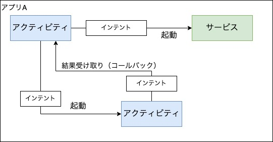

##  インテント（Intent）
インテントは、主にアプリのコンポーネント間の連携に使われる機能。  
別のアプリのコンポーネントへの連携もできる。

## 明示的・暗黙的
インテントには **明示的** なものと **暗黙的** なものがある。

### 明示的インテント
アプリのパッケージ名やコンポーネントのクラス名を直接指定して  
インテントを実行する。

基本的には自分のアプリ内でアクティビティやサービスを起動するのに使われる。



### 暗黙的インテント
具体的なコンポーネントを指定するのではなく、**実行する操作** を指定して  
インテントを実行する。

暗黙的インテントを実行すると、Androidシステムが端末に入っているアプリを検索して  
指定された操作を行えるコンポーネントを探す。

検索に引っかかったアプリがあれば、その中のコンポーネントを起動して  
処理を進めてくれる。  
もし複数あった場合は、起動するアプリをユーザーが選べる。

例えば以下のような使い方がある

* 文章や画像を共有するボタンを押した時、暗黙的インテントで「共有」できるアプリを探す
  - Twitter, LINE, etc...


## PendingIntent
PendingIntentは作成したIntentをラップして生成できる。  
ラップしたIntentを、「自分のアプリから実行されたかのように」他のアプリに使用させることができる。

例えば以下のような使い方がある。

* 指定した時間になると実行されて、通知を行う（AndroidのAlarmManagerが実行する）
  - ゲームアプリでスタミナが全回復した時の通知など

PendingIntentは元のアプリが強制終了しても、それを渡した先のアプリでは引き続き使用できる。

### PendingIntentを作成する
例として、AlarmManagerを使って何かしらのPendingIntentを一定時間後に起動させる。
```java
Context con = activity.getApplicationContext();

// IntentをもとにPendingIntentを作成
Intent intent = new Intent(con, HogeBroadcast.class);
PendingIntent pendingIntent = PendingIntent.getBroadcast(
								con, 
								1, 
								intent, 
								PendingIntent.FLAG_ONE_SHOT | PendingIntent.FLAG_IMMUTABLE);

// AlarmManagerでPendingIntentを1時間後に起動させる
AlarmManager alarmMgr = (AlarmManager)act.getSystemService(Activity.ALARM_SERVICE);  
alarmManager.set(AlarmManager.ELAPSED_REALTIME, 60 * 60 * 1000, pendingIntent);
```

PendingIntentを渡す先によってメソッドを変える必要がある。  
どれも引数は同じ。
```java
PendingIntent.getActivity() // アクティビティ
PendingIntent.getService()  // サービス
PendingIntent.getBroadcast()// ブロードキャストレシーバー
```

### フラグ引数
flagsでPendingIntentの振る舞いを指定できる。  
ビットフラグになっていて、複数指定も可能。

* FLAG_MUTABLE ... 作成元でなくてもPendingIntentの中身を変更できる
* FLAG_IMMUTABLE ... 作成元以外はPendingIntentの中身を変更できない
* FLAG_ONE_SHOT ... このPendingIntentは1回だけ使用できる
* FLAG_UPDATE_CURRENT ... もし同じPendingIntent（`Extra`が違うだけ）が複数存在する場合、今回作成するIntentの`Extra`に設定したデータで置き換える