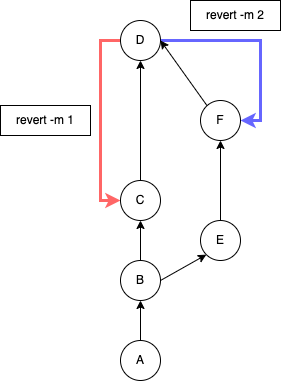

## revert
指定したコミットの内容を取り消すコマンド。  
正確には、「指定したコミットを打ち消すコミットを作成する」コマンドとなっている。

```git test.txt
1
2
+ 3
+ 4
+ 5
```
というコミットがある場合、
```git test.txt
1
2
- 3
- 4
- 5
```
のようなコミットを生成する。

## マージコミットを取り消す
`revert`はそのまま使った場合、マージコミットを取り消すことができない。  
`-m`を指定することでマージコミットにも対応できる。

ただし、取り消し後の状態をどちらに合わせるのかを同時に指定する必要がある。
```bash
# 1 ... マージ先の方に合わせる
# 2 ... マージ元の方に合わせる
git revert -m 1 xxxxxxxx
git revert -m 2 xxxxxxxx
```

### イメージ
（Gitコミットツリーのイメージ）

* 1を指定 ... Cの状態に戻るコミットができる（E,Fのコミット分が取り消される）
* 2を指定 ... Fの状態に戻るコミットができる（Cのコミット分が取り消される）