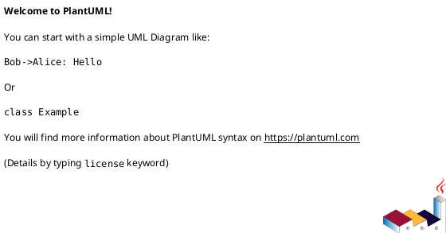
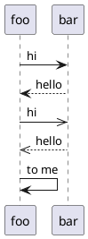
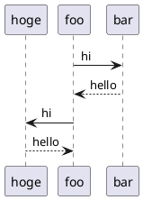
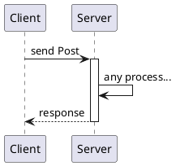
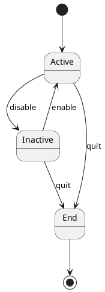
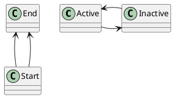

## PlantUML
PlantUMLは、テキストによってクラス図やシーケンス図といった  
様々な図を生成するツール。

図をテキストによって管理できるため、git等で  
簡単にバージョンや差分管理ができる。

ただしあくまで描画のためのツールであるため、テキストが間違っていれば  
論理的に正しくない図が出来上がってしまう。  
（例えばクラス図でいうと「2つのクラスがお互いに継承し合っている」といった図も作れてしまう）

## サポートされている図の種類
* クラス図
* シーケンス図
* ユースケース図
* オブジェクト図
* アクティビティ図
* 状態遷移図
* ER図

シーケンス図とアクティビティ図以外は、  
外部ツールの`graphvis`を別途インストールする必要あり。

## 基本的な使い方
### 開始と終了
`@startuml`から`@enduml`までの範囲がumlの対象になる。


### コメント
行頭に「'」を書くことでコメントになる。
```plantuml
' 行頭に「'」でコメントになる
```

## シーケンス図
矢印と`:`でシーケンス図を作成できる。  
記述した順に処理が書かれていく。
```
[メッセージ元] [矢印の種類] [送信先] : [内容]
```



### 各ラインの表示順を指定する
各ラインは基本的にUML内で出てきた順番に左側から表示される。  
ただし、`participant`で名前を宣言すると宣言した順番で左側から表示される。


### 実行仕様
処理の開始と終了といった実行仕様を表現する場合、  
`activate`と`deactivate`で囲うことで表現できる。

また、複数の`activate`を入れ子にすることも可能。


## 状態遷移図
`[*]`から状態を始めて、`[*]`に繋げて終わらせると状態遷移図になる。

```
[遷移元] --> [遷移先] : [遷移の条件文]
```



### 矢印の向きを指定する
矢印の間に方向を指定することで、描画される  
矢印の向きを固定することができる。

