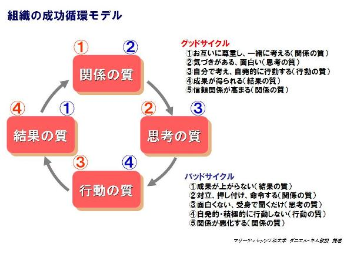

# 概要
組織を運用する上で、良い循環である「グッドサイクル」の流れを作るために、  
組織のリーダーが取るべき行動について記載された記事。

# 参考資料
戦略を実行する第2ステップ―組織の成功循環モデルを知り、リーダーシップを強化する  
https://mag.executive.itmedia.co.jp/executive/articles/1112/05/news007.html

## 組織の循環モデル

組織の成功循環モデルには4つの概念がある。

* 関係の質 ... 組織内の人間関係が良好か
* 思考の質 ... より良いアイデア・気づきを得られるか
* 行動の質 ... 各メンバーが積極的に行動を起こしているか
* 結果の質 ... その組織で良い成果が出せているか

図の赤い丸がグッドサイクル、青い丸がバッドサイクルを表す。

### バッドサイクル
バッドサイクルは最初から結果の質を上げようとしてしまう場合に起こりやすいとされる。  
「結果ばかりを求める組織」では、人間関係がおざなりになってしまいがち。

1. 結果の質 ... 成果がなかなか上がらない
2. 関係の質 ... 原因をお互いに押し付けたり対立が起こるようになる
3. 思考の質 ... 自分から考えることが少なくなり、仕事へのモチベーションが下がる
4. 行動の質 ... 自発的な行動が少なくなり、成果が上がりづらくなる
5. 結果の質 ... さらに成果が上がらなくなる

### グッドサイクル
グッドサイクルは最初に関係の質を上げるところから始まる。  
結果を急ぐのではなく、信頼関係の構築から始めることで最終的な結果に繋がるとされる。

1. 関係の質 ... まずお互いの理解を深め、押し付けではなく一緒に考えるようにする
2. 思考の質 ... 自分だけでは得られない新たな気づきや発想が生まれ、仕事が面白くなる
3. 行動の質 ... モチベーションが上がり、自分から積極的に行動を起こすようになる
4. 結果の質 ... 成果が上がるようになる
5. 関係の質 ... 成果が上がることで、さらなる信頼関係を得られる